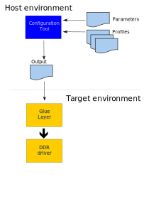

= DDR configuration and initilaization for Synopsis UMCTL-based platforms

== TERMS and ABBREVIATIONS

----
PUB		PHY utility block
SoC		System on a Chip
----

<<<

== Introduction

Purpose of this document is to specify and document the design and
requirements of the DDR customization for Synopsis UMCTL-based
SoC's. This currently implies Fireant, Maserati and Laguna.

Configuring DDR for these platforms is a delicate process including a
lot of configuration parameters. It is furthermore complicated by the
needs for customer customization, sourcing changes and system tuning.

As we wish to provide a better method for enabling customers, many
different boards and current/future SoC's, this document outlines
a possible solution for this.

Primary target audience is:

- *SW Engineers:* This is the group of people who will do the software
  implementation of the proposed solution. Implementation and
  specification must be in alignment.
- *SW-Application:* Parts of this implementation will be directly
  exposed to customers, mainly the configuration tool and associated
  documentation. This group must be consulted to ensure catering for
  customer needs and being able to support the system solution as a
  whole.
- *Chip design:* This group will be consulted to ensure all relevant
  parameters are exposed to customization, and that the driver follow
  the necessary hardware initialization steps.

== Requirements

The system must support the following high-level requirements:

- The system must be able to support the current set of SoC's and
  boards using the UMCTL controller. This imply all Fireant boards,
  Maserati boards and Laguna boards.

- The system must be able to support new SoC's and their boards
  without imposing changes to exposed parameters.

- A set of high-level DDR configuration parameters must be exposed
  for customization of the 'common-case' changes a customer is
  expected to make.

- It should be possible to extend the configuration tool with
  profiles/parameter-sets to support new DDR chip types as required by
  sourcing needs.

- It should be possible to customize DDR parameters for a board
  without necessarily recompiling the firmware for the target system.

- The run-time parts of the system initialization should be as compact
  as possible, and require no floating-point support.

== System design

To implement a system which feature the listed requirements, the
following solution is proposed:

- A host configuration tool is created. This tool will take the actual
  values of the exposed parameters, the applicable DDR parameter sets
  and will produce a 'ready-to-use' DDR controller output configuration
  'snippet'. All necessary calculations will be done in the
  configuration tool.

- The host configuration tool will be able to produce the output
  configuration snippets in different formats to support different
  platforms - binary, "C", YAML and device-tree (DT) format.

- The host configuration tool will operate on input data specified in
  YAML format, and DDR profiles/parameter-sets will be in the same
  format.

- A system-agnostic driver will be created. The driver will accept the
  DDR configuration 'snippet' in *binary* form, along with
  platform-defined DDR register access functions. Using this, the
  driver will be able to perform the full DDR initialization according
  to the UMCTL programmers guide.

- A system-specific 'glue' component will be created to extract the
  DDR configuration 'snippet' and convert it to binary form. It is the
  responsibility of this component to call the base driver, alongside
  with the register access functions. This component could optionally
  provide built-in fallback configuration profiles if initialization
  with the dynamically provided data fails.

The system architecture is outlined in the following diagram:

== Configuration parameters

=== User-level configuration parameters

At the top level, the following user-level parameters are
identified.

* Title: _text_ (This text is accompanying the configuration for identification purposes)

* DDR type: `DDR3`, `DDR4`

* DDR speed: _integer_ (KHz)

* DDR geometry:

  - Column bits
  - Row bits
  - Bank bits
  - Bank group bits
  - Active ranks 1 or 2
  - DQ bits: _x8/x16_
  - DQ bits used: _x16/x32/x40_
  - Density: _4G/8G_

* 2T mode (???): _enabled/disabled_

* ECC mode: _enabled/disabled_

NOTE: Some platforms may not support all parameters.

=== DDR chip parameters

All DDR chip parameters are derived by the user-level parameters,
primarily the DDR mode and speed (grade).

== Output DDR configuration

The DDR output configuration data is as follows.

NOTE: The following data/registers set is taken from
https://bitbucket.microchip.com/projects/UNGE/repos/sw-arm-trusted-firmware/browse/drivers/st/ddr/stm32mp1_ddr.c?at=refs%2Fheads%2Flaguna-v1[drivers/st/ddr/stm32mp1_ddr.c]
and the associated header file
https://bitbucket.microchip.com/projects/UNGE/repos/sw-arm-trusted-firmware/browse/include/drivers/st/stm32mp1_ddr.h?at=refs%2Fheads%2Flaguna-v1[include/drivers/st/stm32mp1_ddr.h].
The driver is going to be used as a reference to implement the
Microchip equivalent, and it is expected to change the register set
as required/desired.

=== Info

* Title: _text_ (from input)
* Speed
* Memory size

=== Main control registers

[cols="1,5*^"]
|===
| registers | ddr tcl | fa ddr3 | fa ddr4 | stm32mp1 | comments

| mstr
| yes
| yes
| yes
| yes
| 
| mrctrl0
| -
| -
| -
| yes
| 
| mrctrl1
| -
| -
| -
| yes
| 
| derateen
| -
| -
| -
| yes
| 
| derateint
| -
| -
| -
| yes
| 
| pwrctl
| yes
| yes
| yes
| yes
| 
| pwrtmg
| -
| -
| -
| yes
| 
| hwlpctl
| -
| -
| -
| yes
| 
| rfshctl0
| yes
| yes
| yes
| yes
| 
| rfshctl3
| yes
| yes
| yes
| yes
| 
| crcparctl0
| -
| -
| -
| yes
| 
| zqctl0
| -
| -
| -
| yes
| 
| dfitmg0
| yes
| yes
| yes
| yes
| 
| dfitmg1
| yes
| yes
| yes
| yes
| 
| dfilpcfg0
| -
| -
| -
| yes
| 
| dfiupd0
| yes
| yes
| yes
| yes
| 
| dfiupd1
| yes
| yes
| yes
| yes
| 
| dfiupd2
| -
| -
| -
| yes
| 
| dfiphymstr
| -
| -
| -
| yes
| 
| odtmap
| -
| -
| -
| yes
| 
| dbg0
| -
| -
| -
| yes
| 
| dbg1
| -
| -
| -
| yes
| 
| dbgcmd
| -
| -
| -
| yes
| 
| poisoncfg
| -
| -
| -
| yes
| 
| pccfg
| yes
| -
| -
| yes
| 
|===

=== Timing configuration registers

[cols="1,5*^"]
|===
| registers | ddr tcl | fa ddr3 | fa ddr4 | stm32mp1 | comments

| rfshtmg
| yes
| yes
| yes
| yes
| 
| dramtmg0
| yes
| yes
| yes
| yes
| 
| dramtmg1
| yes
| yes
| yes
| yes
| 
| dramtmg2
| yes
| yes
| yes
| yes
| 
| dramtmg3
| yes
| yes
| yes
| yes
| 
| dramtmg4
| yes
| yes
| yes
| yes
| 
| dramtmg5
| yes
| yes
| yes
| yes
| 
| dramtmg8
| yes
| yes
| yes
| yes
| 
| dramtmg9
| yes
| -
| yes
| yes
| Only used when x16 width
| odtcfg
| yes
| yes
| yes
| yes
| 
|===

=== Address map configuration registers

[cols="1,5*^"]
|===
| registers | ddr tcl | fa ddr3 | fa ddr4 | stm32mp1 | comments

| addrmap0
| yes
| yes
| yes
| yes
| 
| addrmap1
| yes
| yes
| yes
| yes
| 
| addrmap2
| yes
| yes
| yes
| yes
| 
| addrmap3
| yes
| yes
| yes
| yes
| 
| addrmap4
| yes
| yes
| yes
| yes
| 
| addrmap5
| yes
| yes
| yes
| yes
| 
| addrmap6
| yes
| yes
| yes
| yes
| 
| addrmap7
| yes
| yes
| yes
| yes
| 
| addrmap8
| yes
| yes
| yes
| yes
| 
|===

=== Performance configuration registers

[cols="1,5*^"]
|===
| registers | ddr tcl | fa ddr3 | fa ddr4 | stm32mp1 | comments

| sched
| -
| -
| -
| yes
| 
| sched1
| -
| -
| -
| yes
| 
| perfhpr1
| -
| -
| -
| yes
| 
| perflpr1
| -
| -
| -
| yes
| 
| perfwr1
| -
| -
| -
| yes
| 
| pcfgr_0
| -
| -
| -
| yes
| 
| pcfgw_0
| -
| -
| -
| yes
| 
| pcfgqos0_0
| -
| -
| -
| yes
| 
| pcfgqos1_0
| -
| -
| -
| yes
| 
| pcfgwqos0_0
| -
| -
| -
| yes
| 
| pcfgwqos1_0
| -
| -
| -
| yes
| 
| pcfgr_1
| -
| -
| -
| yes
| 
| pcfgw_1
| -
| -
| -
| yes
| 
| pcfgqos0_1
| -
| -
| -
| yes
| 
| pcfgqos1_1
| -
| -
| -
| yes
| 
| pcfgwqos0_1
| -
| -
| -
| yes
| 
| pcfgwqos1_1
| -
| -
| -
| yes
| 
|===

=== DDR PHY registers

[cols="1,5*^"]
|===
| registers | ddr tcl | fa ddr3 | fa ddr4 | stm32mp1 | comments

| pgcr
| -
| -
| -
| yes
| 
| aciocr
| -
| -
| -
| yes
| 
| dxccr
| yes
| yes
| yes
| yes
| 
| dsgcr
| yes
| yes
| yes
| yes
| 
| dcr
| yes
| yes
| yes
| yes
| 
| odtcr
| -
| -
| -
| yes
| 
| zq0cr1
| -
| -
| -
| yes
| 
| dx0gcr
| -
| -
| -
| yes
| 
| dx1gcr
| -
| -
| -
| yes
| 
| dx2gcr
| -
| -
| -
| yes
| 
| dx3gcr
| -
| -
| -
| yes
| 
|===

=== DDR PHY timing registers

[cols="1,5*^"]
|===
| registers | ddr tcl | fa ddr3 | fa ddr4 | stm32mp1 | comments

| ptr0
| yes
| yes
| yes
| yes
| 
| ptr1
| yes
| yes
| yes
| yes
| 
| ptr2
| -
| -
| -
| yes
| 
| dtpr0
| yes
| yes
| yes
| yes
| 
| dtpr1
| yes
| yes
| yes
| yes
| 
| dtpr2
| yes
| yes
| yes
| yes
| 
| mr0
| yes
| -
| -
| yes
| 
| mr1
| yes
| -
| -
| yes
| 
| mr2
| yes
| -
| -
| yes
| 
| mr3
| yes
| -
| -
| yes
| 
|===

=== DDR PHY calibration registers

[cols="1,5*^"]
|===
| registers | ddr tcl | fa ddr3 | fa ddr4 | stm32mp1 | comments

| dx0dllcr
| -
| -
| -
| yes
| 
| dx0dqtr
| -
| -
| -
| yes
| 
| dx0dqstr
| -
| -
| -
| yes
| 
| dx1dllcr
| -
| -
| -
| yes
| 
| dx1dqtr
| -
| -
| -
| yes
| 
| dx1dqstr
| -
| -
| -
| yes
| 
| dx2dllcr
| -
| -
| -
| yes
| 
| dx2dqtr
| -
| -
| -
| yes
| 
| dx2dqstr
| -
| -
| -
| yes
| 
| dx3dllcr
| -
| -
| -
| yes
| 
| dx3dqtr
| -
| -
| -
| yes
| 
| dx3dqstr
| -
| -
| -
| yes
| 
|===

=== DDR registers not mapped to configuration registers

[cols="1,5*^"]
|===
| register | ddr tcl | fa ddr3 | fa ddr4 | stm32mp1 | comments

| bistar0
| -
| -
| yes
| -
| 
| bistar1
| -
| -
| yes
| -
| 
| bistar3
| -
| -
| yes
| -
| 
| bistudpr
| -
| -
| yes
| -
| 
| crcparctl1
| yes
| -
| yes
| -
| 
| dbictl
| yes
| -
| yes
| -
| 
| dfimisc
| yes
| yes
| yes
| -
| 
| dramtmg12
| yes
| -
| -
| -
| 
| dtcr0
| yes
| yes
| yes
| -
| 
| dtcr1
| yes
| yes
| yes
| -
| 
| dtpr3
| yes
| yes
| yes
| -
| 
| dtpr4
| yes
| yes
| yes
| -
| 
| dtpr5
| yes
| yes
| yes
| -
| 
| dx0bdlr0
| -
| yes
| yes
| -
| 
| dx0bdlr1
| -
| yes
| yes
| -
| 
| dx0bdlr2
| -
| yes
| yes
| -
| 
| dx0gcr5
| -
| -
| yes
| -
| 
| dx0gtr0
| yes
| yes
| yes
| -
| 
| dx1bdlr0
| -
| yes
| yes
| -
| 
| dx1bdlr1
| -
| yes
| yes
| -
| 
| dx1bdlr2
| -
| yes
| yes
| -
| 
| dx1gcr5
| -
| -
| yes
| -
| 
| dx1gtr0
| yes
| yes
| yes
| -
| 
| dx2bdlr0
| -
| yes
| yes
| -
| 
| dx2bdlr1
| -
| yes
| yes
| -
| 
| dx2bdlr2
| -
| yes
| yes
| -
| 
| dx2gcr0
| yes
| -
| -
| -
| 
| dx2gcr5
| -
| -
| yes
| -
| 
| dx2gtr0
| yes
| yes
| yes
| -
| 
| dx3bdlr0
| -
| yes
| yes
| -
| 
| dx3bdlr1
| -
| yes
| yes
| -
| 
| dx3bdlr2
| -
| yes
| yes
| -
| 
| dx3gcr0
| yes
| -
| -
| -
| 
| dx3gcr5
| -
| -
| yes
| -
| 
| dx3gtr0
| yes
| yes
| yes
| -
| 
| dx4bdlr0
| -
| yes
| yes
| -
| 
| dx4bdlr1
| -
| yes
| yes
| -
| 
| dx4bdlr2
| -
| yes
| yes
| -
| 
| dx4gcr0
| yes
| -
| -
| -
| 
| dx4gcr5
| -
| -
| yes
| -
| 
| dx4gtr0
| yes
| yes
| yes
| -
| 
| ecccfg0
| yes
| yes
| yes
| -
| 
| eccpoisonaddr0
| yes
| -
| -
| -
| 
| eccpoisonaddr1
| yes
| -
| -
| -
| 
| init0
| yes
| yes
| yes
| -
| 
| init1
| yes
| yes
| yes
| -
| 
| init3
| yes
| yes
| yes
| -
| 
| init4
| yes
| yes
| yes
| -
| 
| init5
| yes
| yes
| yes
| -
| 
| init6
| yes
| -
| yes
| -
| 
| init7
| yes
| -
| yes
| -
| 
| iovcr0
| yes
| yes
| yes
| -
| 
| iovcr1
| yes
| yes
| yes
| -
| 
| mr0_ddr4
| yes
| -
| -
| -
| 
| mr0_lpddr3
| -
| yes
| yes
| -
| 
| mr1_ddr4
| yes
| -
| -
| -
| 
| mr1_lpddr3
| -
| yes
| yes
| -
| 
| mr2_ddr4
| yes
| -
| -
| -
| 
| mr2_lpddr3
| -
| yes
| yes
| -
| 
| mr3_ddr4
| yes
| -
| -
| -
| 
| mr3_lpddr3
| -
| yes
| yes
| -
| 
| mr4_ddr4
| yes
| -
| -
| -
| 
| mr4_lpddr3
| -
| -
| yes
| -
| 
| mr5_ddr4
| yes
| -
| -
| -
| 
| mr5_lpddr3
| -
| -
| yes
| -
| 
| mr6_ddr4
| yes
| -
| -
| -
| 
| mr6_lpddr3
| -
| -
| yes
| -
| 
| pctrl_0
| -
| yes
| yes
| -
| 
| pgcr0
| yes
| yes
| yes
| -
| 
| pgcr1
| yes
| yes
| yes
| -
| 
| pgcr2
| yes
| yes
| yes
| -
| 
| pgcr3
| yes
| yes
| yes
| -
| 
| pgcr7
| yes
| yes
| yes
| -
| 
| pir
| yes
| yes
| yes
| -
| 
| ptr3
| yes
| yes
| yes
| -
| 
| ptr4
| yes
| yes
| yes
| -
| 
| rankctl
| yes
| yes
| yes
| -
| 
| rankidr
| yes
| yes
| yes
| -
| 
| rfshctl1
| yes
| yes
| yes
| -
| 
| sbrctl
| -
| yes
| yes
| -
| 
| sbrwdata0
| -
| yes
| yes
| -
| 
| schcr1
| yes
| -
| -
| -
| 
| swctl
| yes
| yes
| yes
| -
| 
| vtcr0
| -
| -
| yes
| -
| 
| vtcr1
| -
| -
| yes
| -
| 
| zq0pr
| -
| yes
| yes
| -
| 
| zq1pr
| -
| yes
| yes
| -
| 
| zq2pr
| -
| yes
| yes
| -
| 
| zqcr
| yes
| yes
| yes
| -
| 
